# שיוך משלוחים למתנדב
מסך זה משמש לשיוך משלוחים למתנדבים ולהוציא אותם לדרך.

<iframe width="560" height="315" src="https://www.youtube.com/embed/8LCeQRQPL1U" frameborder="0" allow="accelerometer; autoplay; clipboard-write; encrypted-media; gyroscope; picture-in-picture" allowfullscreen></iframe>

## בחירת מתנדב

יש הקליד את מספר הטלפון של המתנדב, אם המתנדב קיים - שמו יוצג - אם הוא אינו קיים יש להקליד גם את שם המתנדב כדי להקימו במערכת.

ניתן גם לחפש מתנדב לפי שם על ידי לחיצה על כפתור החיפוש לפי שם
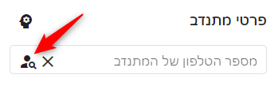

## שיוך המשלוחים למתנדב
לחיצה על הכפתור **שייך משלוח כלשהו** תשייך משלוח נוסף למתנדב.

לאחר מכן שם הכפתור ישתנה ל**שייך משלוח הכי קרוב**, וכל לחיצה עליו תוסיף משלוח נוסף
המערכת תדאג לבחור כתובות קרובות ככל האפשר אחת לשניה.

ניתן גם לבחור משפחות לפי שם, רחוב או על המפה - על ידי לחיצה על ה**שלש נקודות לבנות על רקע אפור** ובחירת אפשרויות נוספות

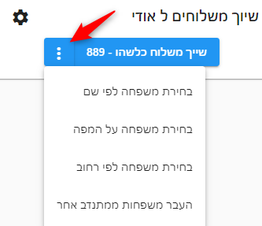

### עדיפות למשפחות שהמתנדב היה אצלהן
במקרה של מתנדב שכבר התנדב בעבר, ניתן להעדיף בשיוך משלוחים, משפחות שהמתנדב כבר היה אצלהן.

אצל מתנדב שכזה, תופיע תיבת סימון "עדיפות למשפחות שהמתנדב היה אצלהן" - כאשר תיבה זו מסומנת, יועדפו משפחות שהוא כבר היה אצלהן.

בנוסף יש אפשרות לבחור ממשפחות אלו בצורה שמית על ידי לחיצה על:

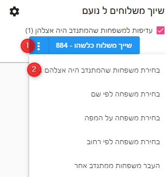

### סינון נוסף למשלוחים
ניתן לבחור אפשרויות נוספות לסינון המשלוחים אשר ישוייכו למתנדב, על ידי לחיצה על הגלגל שיניים משמאל לכותרת שיוך משלוחים

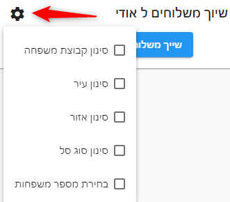

### משפחות קבועות/משלוחים קבועים
ניתן לשמור את המשלוחים אשר שוייכו למתנדב כמשלוחים קבועים עבורו על ידי לחיצה על:

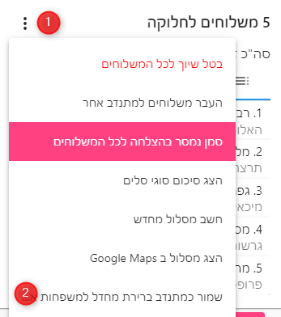

המשמעות היא שכל פעם שיוגדרו משלוחים עבור משפחות אלו, הם ישוייכו באופן אוטומטי למתנדב זה.

### אזורים מועדפים למתנדב
ניתן להגדיר למתנדב כתובות מועדפות, אשר המערכת תעדיף לשייך לו משפחות קרובות אליהן.

את כתובות אלו ניתן להגדיר בפרטי מתנדב:

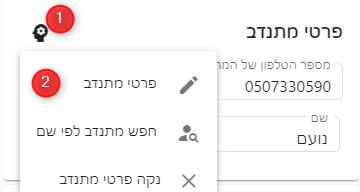

ניתן להגדיר עבור המתנדב שתי כתובות:
1. כתובת אזור חלוקה
2. כתובת לסיום המסלול - כתובת זו תשמש את המערכת בתכנון המסלול, ותסדר אותו כך שהמסלול יגמר במשלוח הקרוב ביותר לכתובת זו

::: tip טיפ
המתנדב יכול להגדיר הגדרות אלו עבור עצמו, בתפריט הגדרות אישיות
:::

## משלוחים לחלוקה
לאחר שישוייכו משלוחים למתנדב הם יופיע תחת הכתורת **X משלוחים לחלוקה**

ניתן לצפות במשלוחים בתצוגת רשימה או בתצוגת מפה

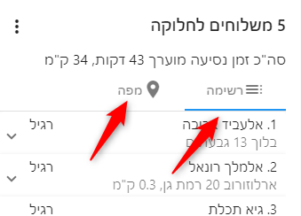

### פרטי משלוח למתנדב
ברשימה ניתן ללחוץ על כל שורת משלוח בכדי לראות פרטים נוספים
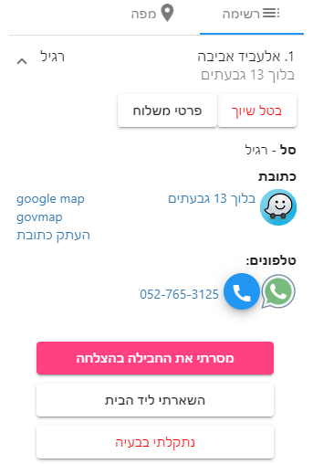

1. לחיצה על האייקון של WAZE תפתח את תוכנת הניווט
2. לחיצה על האייקון של ווטסאפ - תשלח ווטסאפ למשפחה
3. לחיצה על האייקון של הטלפון תחייג למשפחה
4. לחיצה על מסרתי בהצלחה, תעדכן שהסל נמסר ותאפשר למתנדב לכתוב הערה
    * ניתן לשנות את שם הכפתור ואת ההודעה שתופיע למשתמש, במסך "הגדרות מערכת/הודעות למתנדב"
5. לחיצה על השארתי ליד הבית, תעדכן שהסל הושאר ליד הבית ותאפשר למתנדב לכתוב הערה
    * ניתן להסתיר כפתור זה בהגדרות מערכת/העדפות
6. לחיצה על נתקלתי בבעיה, תפתח חלון בו המתנדב יכול לפרט מה הבעיה ולהתקשר לקבלת עזרה

    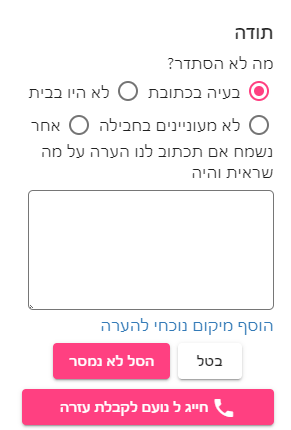
    * ניתן להגדיר את הטלפונים לעזרה במסך הגדרות מערכת
    * ניתן להגדיר סט של שאלות ותשובות שיופיעו למתנדב כאשר הוא נתקן בבעיה במסך הגדרות מערכת

### ביטול שיוך המשלוח למתנדב
ניתן לבטל שיוך של משלוח למתנדב על ידי לחיצה על המשלוח ואז לחיצה על הכפתור **בטל שיוך**

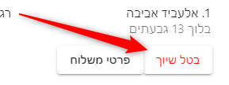

#### ביטול שיוך כל המשלוחים למתנדב
ניתן לבטל את שיוך כל המשלוחים של המתנדב על ידי לחיצה על:

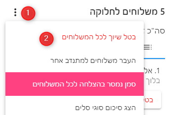

## שליחת הודעת SMS עם קישור
לאחר השלמת שיוך המשלוחים למתנדב, יש ללחות על הכפתור **שלח הודעת SMS עם קישור**. פעולה זו תשלח הודעת SMS למתנדב עם קישור למשלוחים המשוייכים לו והמערכת תעבור לשיוך המתנדב הבא.

### שליחה באמצעות whatsapp

לחצו על השלש נקודות הלבנות על רקע אדום ובחרו באפשרות **שלח קישור בwhatsapp** לפתיחת ווטסאפ על הודעה מוכנה לשליחה.

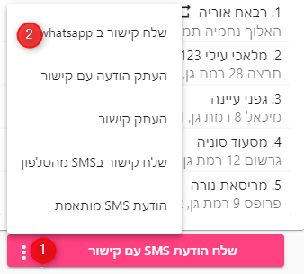

### הדפסה
ניתן להדפיס את רשימת המשפחות למתנדב, על ידי בחירת אפשרות ההדפסה בדפדפן - או לחיצה על קיצור המקשים CTRL P

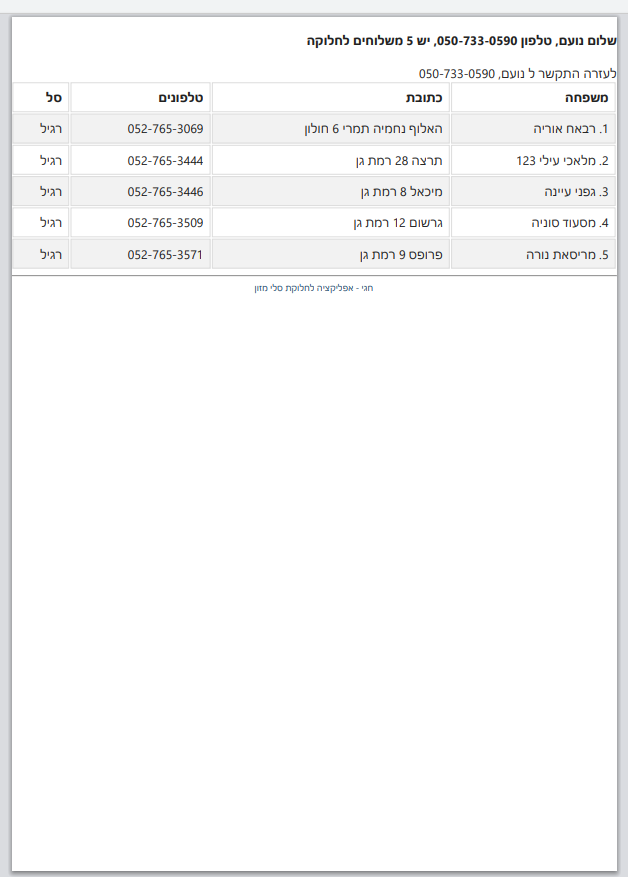

## מה עושים אם הSMS לא מגיע
לפעמים לוקח להודעת הSMS כמה דקות להגיע עקב עומס עם הרשת הסלולרית או מסיבות אחרות.

במקרה הזה ניתן לפעול בחלופות הבאות:
1. [שליחה באמצעות whatsapp](#שליחה-באמצעות-whatsapp)
2. אפשר לנסות לשלוח את הודעת הSMS מהטלפון עצמו על ידי בחירה באפשרות "שלי קישור בSMS מהטלפון"
3. אפשר להזמין את המתנדב להכנס לאתר האפליקציה עם הסיומת שלכם, ואז הוא יוכל להקליד את מספר הטלפון שלו ולראות את רשימת המשפחות שלו

   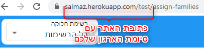

[מצאתם טעות? עזרו לנו לתקן](https://github.com/noam-honig/food-basket-delivery/tree/master/docs/guide/README.md)