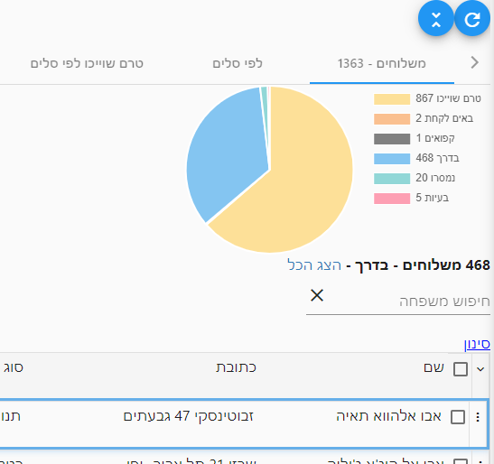
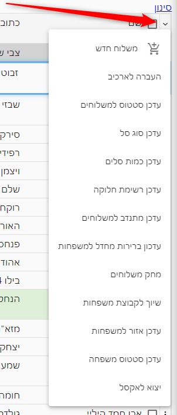
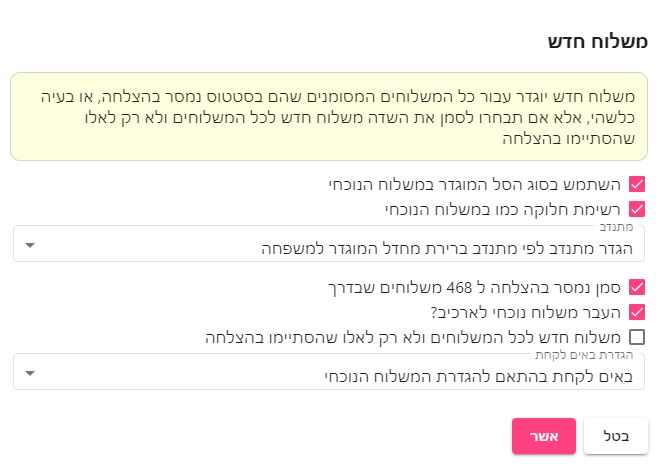
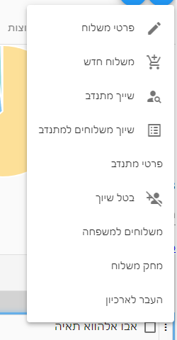

# משלוחים פעילים

מסך משלוחים פעילים מציג את המשלוחים הפעילים כרגע. כדי לראות את כל המשפחות יש לפתוח את מסך משפחות.
::: tip טיפ
להסבר על תפעול המסך מומלץ מאד לקרוא את המאמר
[טבלאות](use-table.html)
 לפני שקוראים מאמר זה
:::

## לשונית משלוחים
בלשונית זו מוצג פאי המציג את התפלגות המשלוחים לפי סטטוס.
1. **טרם שוייכו** - משלוחים שטרם שוייכו למתנדב
2. **מיוחדים שטרם שוייכו** - מציג את המשלוחים אשר סומנו כ"[שיוך מיוחד](http://localhost:8080/hagai-docs/guide/family-info.html#%D7%A9%D7%99%D7%95%D7%9A-%D7%9E%D7%99%D7%95%D7%97%D7%93) בפרטי משפחה
3. **באים לקחת** - משלוחים אשר המשפחות מגיעות לקחת לבד ועדיין לא הושלמו
4. **קפואים** - משלוחים שעודכנו לסטטוס מוקפא
5. **בדרך** - משלוחים אשר שוייך להם מתנדב ועדיין לא הושלמו
6. **נמסרו** - משלוחים שהושלמו
7. **בעיות** - משלוחים שהמתנדב עדכן שלא נמסרו

## לשוניות סלים
לשוניות אלו יציגו את כמות המנות לפי סוג סל

1. **לפי סל** - כמות המנות הכוללת לפי סוג סל
2. **טרם שוייכו לפי סלים** - כמות המנות במשלוחים שטרם שוייך להם מתנדב, לפי סוג סל
3. **שוייכו וטרם יצאו לפי סלים** - כמות המנות במשלוחים אשר משוייך להם מתנדב, אבל טרם נשלח להם SMS.
   ::: tip טיפ
   במקרים בהם משייכים משלוחים למתנדבים מראש - מומלץ לשלוח להם את הSMS רק כאשר הם מגיעים לקחת וכך ניתן להבדיל בין מתנדבים שכבר אספו את הסלים לכאלו שעוד לא הגיעו
   :::
4. **באים לקחת לפי סלים**
5. **נמסרו לפי סלים**

## לשוניות נוספות
1. טרם שוייכו לפי קבוצות
2. לפי קבוצות
3. טרם שוייכו לפי ערים
4. צריך טיפול/מעקב

## פעולות על מספר משלוחים
מתפריט הטבלה ניתן לבצע את הפעולות הבאות אשר יתבצעו עבור כל המשלוחים המסומנים - ואם לא סומן כלל, אז עבור כל המשלוחים המוצגים

### משלוח חדש
פעולה זו תיצור משלוח חדש לכל המשלוחים המסומנים. 

### העברה לארכיב (ארכיון)
פעולה זו תעביר את המשלוחים המסומנים לארכיב ותסיר אותם ממסך משלוחים פעילים.

באופן הזה ניתן להשאיר במסך משלוחיפ פעילים רק משלוחים שעודים עליהם כעט.

::: tip טיפ
מומלץ בסיום חלוקה להעביר את המשלוחים של אותה חלוקה לארכיב כדי לנקות
:::

### מחק משלוחים
מחיקת המשלוחים המסומנים - נועד למחיקת משלוחים שנוצרו להדגמה או בטעות.

### עדכן סטטוס למשלוחים
### עדכן סוג סל
### עדכן כמות סלים
### עדכן רשימת חלוקה
### עדכן מתנדב למשלוחים
### עדכון ברירת מחדל למשפחות
פעולה זו מאפשרת לעדכן את הגדרות הברירת משלוח של המשפחות בהתאם למשלוח הנוכחי.
### שיוך לקבוצות משפחות
### עדכון סטטוס משפחה
### יצוא לאקסל

## תפריט שורה
עבור כל משלוח ניתן לבצע את הפעולות הבאות בתפריט השורה:

[מצאתם טעות? עזרו לנו לתקן](https://github.com/noam-honig/food-basket-delivery/tree/master/docs/guide/active-deliveries.md)