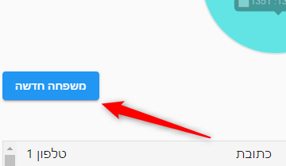
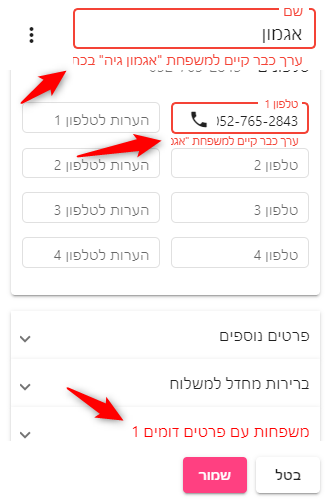

# הוספת משפחה - איך מוסיפים משפחה?
לוחצים על כפתור **משפחה חדשה** המופיע גם במסך משפחות וגם במסך משלוחים פעילים.

לחיצה על כפתור זה תפתח את מסך [פרטי משפחה](family-info.html) להוספת המשפחה ופרטיה

## בדיקות כפילות משפחה
כאשר מוסיפים או מעדכנים משפחה, המערכת בודקת באופן אוטומטי אם כבר קיימת משפחה עם **שם דומה, טלפון זהה או מספר זהות זהה**

במקרה שנמצאה משפחה כזו - תופיע אזהרה בצבע אדום ליד הנתון המתאים ותופיע לשונית נוספת בצבע אדום בשם **משפחות עם פרטים דומים**

בלשונית **משפחות עם פרטים דומים** ניתן לראות את המשפחות עם הנתונים הדומים.

אם אחת מהם היא המשפחה שאתם רוצים להוסיף, פשוט ערכו אותה בלשונית **משפחות עם פרטים דומים** ובטלו את ההוספה.

## הוספת משלוח למשפחה החדשה
לאחר מסך הוספת משפחה יופיע מסך הוספת משלוח למשפחה בו ניתן להגדיר את המשלוח.

[מצאתם טעות? עזרו לנו לתקן](https://github.com/noam-honig/food-basket-delivery/tree/master/docs/guide/add-family.md)
