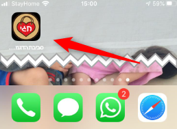
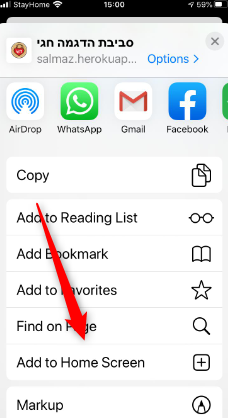
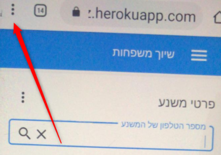
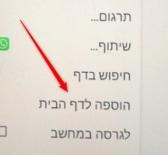
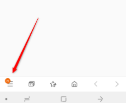
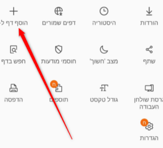
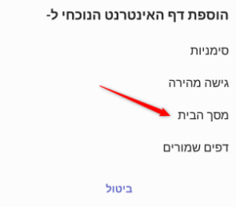
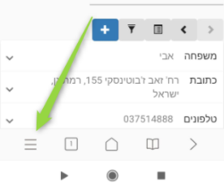
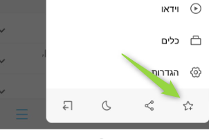
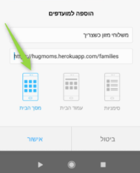

# הוספת האפליקציה למסך הבית בטלפון

אפשר להוסיף את האפליקציה לדף הבית, כך שנוכל להפעיל אותה כמו אפליקציה ולא רק דרך הלינק.

## IPHONE
נתחיל בIphone  כי זה הכי הכי קל.
1. לוחצים על כפתור השיתוף

   
2. גוללים למטה ובוחרים ב**הוסף למסך הבית**

   
3. בוחרים שם ושומרים
   
   

## Android

לאנדרויד יש מספר אפשרויות - ובכל טלפון זה קצת אחר, להלן האפשרויות שאנחנו מכירים עד היום, אם אתם מכירים עוד - שלחו לנו תמונות
### אנדרויד אפשרות 1, דפדפן כרום

### אנדרויד אפשרות 2

### אנדרויד אפשרות 3

[מצאתם טעות? עזרו לנו לתקן](https://github.com/noam-honig/food-basket-delivery/tree/master/docs/guide/add-to-home-screen.md)