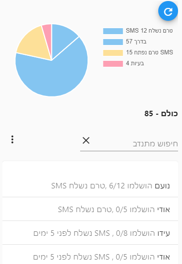
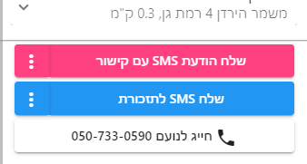
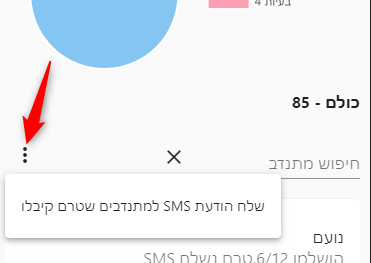

# מעקב מתנדבים

מסך זה מציג את כל התמנדבים להם שוייכו משפחות, ואת ההתקדמות שלהם בחלוקה.

בחלקו העליון של המסך מוצג פאי המפרט את התפלגות המתנדבים לפי סטטוסים:
1. **טרם נשלח SMS** - מתנדבים אשר משוייכים להם משפחות, אבל עוד לא נשלח להם SMS עם הקישור לחלוקה.
   ::: tip טיפ
   במקרים בהם משייכים משלוחים למתנדבים מראש - מומלץ לשלוח להם את הSMS רק כאשר הם מגיעים לקחת וכך ניתן להבדיל בין מתנדבים שכבר אספו את הסלים לכאלו שעוד לא הגיעו
   :::
2. **SMS טרם נפתח** - מתנבים להם נשלחה הודעת SMS אבל עדיין לא נכנסו למערכת
3. **בדרך** - מתנדבים אשר פתחו את הודעת הSMS ומכאן אנו מניחים שהם נמצאים בחלוקה
4. **בעיות** - מתנדבים להם יש לפחות משלוח אחד בסטטוס בעיה
5. **סיימו** - מתנדבים אשר סיימו את כל המשלוחים שלהם בהצלחה

לחיצה על כל אחת מפרוסות הפאי תסנן את הרשימה למטה להציג רק את המתנדבים המתאימים לאותה הפרוסה

## המשלוחים של המתנדב
לחיצה על שם המתנדב צמיג את מסך 
[שיוך משלוחים למתנדב](/guide/)
עבור אותו המתנדב.

למסך יתווספו שני כפתורים
1. שלח SMS תזכורת - את נוסך התזכורת אפשר להגדיר בהגדרות מערכת.
2. חייג למתנדב

## שליחת הודעת SMS לכל המתנדבים שטרם נשלח להם SMS
ישנה אפשרות לשלוח SMS לכל המתנדבים אשר טרם נשלח להם SMS:

[מצאתם טעות? עזרו לנו לתקן](https://github.com/noam-honig/food-basket-delivery/tree/master/docs/guide/delivery-followup.md)
