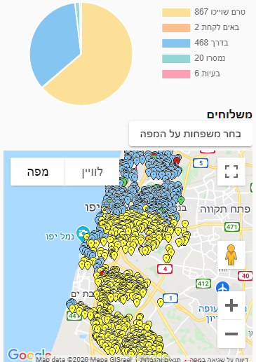
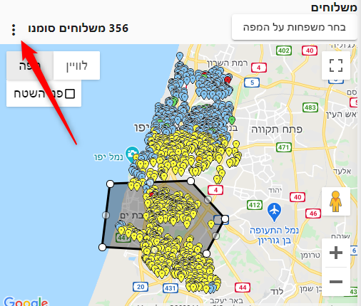
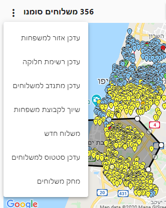

# מפת הפצה

במפת ההפצה ניתן לראות את כל המשלוחים הפעילים בתצוגת מפה

בראש המסך מופיע פאי אם התפלגות המשלוחים לפי סטטוסים.

על המפה ניתן ללחוץ על כל סימון - ולערוך את פרטי המשלוח עבור אותו הסימן.
## בחירת משפחות על המפה

ניתן לבחר משפחות על המפה, ולבצע פעולות על המשפחות שנבחרו.
1. לחצו על הכפתור **בחר משפחות על המפה**
2. סמנו שטח בעזרת לחיצות חוזרות על העכבר
3. בצד שמאל למעלה יופיע מספר המשלוחים שסומנו
4. ניתן לבצע פעולות על משלוחים אלו בלחיצה על השלש נקודות משמאל

לדוגמא ניתן לעדכן את השדה אזור למשלוחים המסומנים, ואז לסנן לפי אזור במסך **שיוך משלוחים למתנדב**

[מצאתם טעות? עזרו לנו לתקן](https://github.com/noam-honig/food-basket-delivery/tree/master/docs/guide/distribution-map.md)