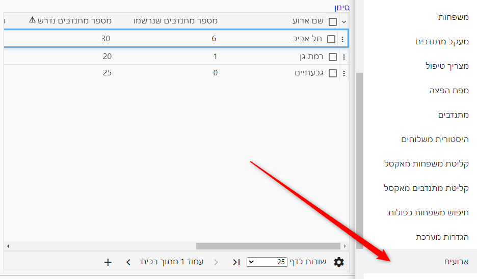
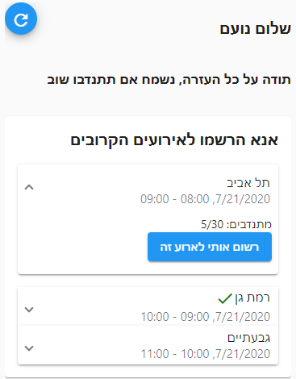

# רישום עצמי של מתנדבים לארועים
ניתן להגדיר ארועים להם מתנדבים יכולים להרשם, וכך לדעת מראש כמה מתנדבים אמורים להגיע.

פעולה זו ניתן לבצע ממסך **ארועים** בתפריט:

## רישום עצמי של המתנדב
פשוט שלחו למתנדבים שלכם קישור לסביבה שלכם:

המתנדב יתבקש להזין מספר טלפון, ואם הוא עוד לא קיים במערכת, המערכת תבקש גם שם ותקים אותו כמתנדב, ואז יוצגו הארועים באופן הבא:

## פרטי ארוע
עבור כל ארוע ניתן להגדיר את ההגדרות הבאות:

### סטטוס ארוע
ארוע יכול להיות באחד מהסטטוסים הבאים:
1. **פתוח לרישום** - הארוע יופיע למתנדבים והם יוכלו להרשם אליו
2. **טיוטא** - הארוע לא יופיע למתנדבים
3. **ארכיון** 

### הצגת ארכיון הארועים
כאשר ארוע מועבר לארכיון - הוא אינו מוצג ברשימה.

ניתן להציג אותו על ידי בחירת האפשרות "הצג ארכיב" בתפריט הטבלה 

## שכפול ארועים
במקרים רבים מוגדרים מספר ארועים שחוזרים על עצמם מידי שבוע.

במקרה הזה, יש לשכפל את הארועים משבוע לשבוע - על ידי סימון שורות הארועים בטבלה, ובחירה באפשרות  **שכפל ארוע**

## מתנדבים רשומים לאירוע
ניתן לראות את המתנדבים המשוייכים לארוע, בעזרת תפריט השורה, אפשרות **מתנדבים**

במסך שנפתח יוצגו המתנדבים שנרשמו לארוע.

ממסך זה אפשר לשייך משלוחים לכל מתנדב, ולהוסיף מתנדבים נוספים אם רוצים.