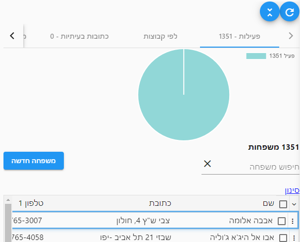
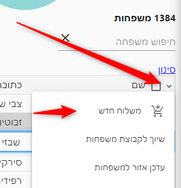
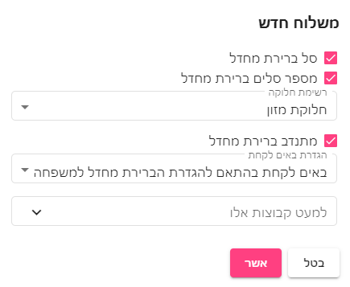
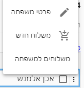
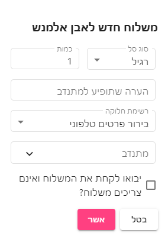

# משפחות

מסך זה מציג את כלל מאגר המשפחות של הארגון

::: tip טיפ
להסבר על תפעול המסך מומלץ מאד לקרוא את המאמר
[טבלאות](use-table.html)
 לפני שקוראים מאמר זה
:::

במסך זה יש מספר לשוניות עיקריות:
## פעילות
מציג את כל המשפחות בסטטוס פעיל

## לפי קבוצות
מציג את המשפחות בהתפלגות לפי קבוצות, שימו לב שמשפחה תשוייך ליותר קבוצה מאחת.

## כתובות בעיתיות
לשונית זו מציגה את המשפחות אשר גוגל לא בטוח בקשר לכתובת שלהן.

::: tip טיפ
מומלץ מאד לעבור על הכתובות הללו ולתקן אותן כך שהן פניו למקום הנכון.

כל דקה שתשקיעו במסך הזה, תחסוך שעות ותסכול מהמתנדבים
:::

::: danger גוגל לא מושלם
בערך 10% מהכתובות גוגל לא מוצא כמו שצריך.

בנוסף, ישנם מקרים שבהם למרות שבכתובת כתוב עיר אחת גוגל יפנה לכתובת בעיר אחרת.

מומלץ לעבור גם על לשונית עיר ולראות שהערים הם נכונות.

לדוגמא - אם כותבים את הכתובת "זלמן שזר תל אביב" גוגל ימצא את רחוב "זלמן שזר רמת גן" וזה **נורא מעצבן מתנדבים** ובצדק.
במקרים כאלו יש לחפש טוב לרשום את זה כדי שגוגל ימצא את זה נכון.

במקרה הזה יש לכתוב "שזר תל אביב" (מה לעשות שבתל אביב זה לא זלמן :))
:::

## עיר
בלשונית זו מוצגות המשפחות לפי עיר
## מתנדב ברירת מחדל
בלשונית זו מוצגות השפחות לפי המתנדב ברירת מחדל שלהן
## אזור
בלשונית זו מוצגות המשפחות לפי אזור
## כל המשפחות
בלשונית זו מוצגות משפחות בכל הסטטוסים ולא רק בסטטוס פעיל.

להסבר על סטטוס משפחה ראו [סטטוס משפחה](family-info.html#%D7%A1%D7%98%D7%98%D7%95%D7%A1-%D7%A1%D7%98%D7%98%D7%95%D7%A1-%D7%9E%D7%A9%D7%A4%D7%97%D7%94)

## הוספת משלוח למשפחות המסומנות
ב[תפריט הטבלא](use-table.html#_3-תפריט-טבלה), יש לבחור באפשרות **משלוח חדש**

פעולה זו תיצור משלוח חדש לכל המשפחות המסומנות בטבלה

## ייצוא משפחות לאקסל
ב[תפריט הטבלה](use-table.html#_3-תפריט-טבלה)
 יש לבחור באפשרות יצוא לאקסל

## הוספת משלוח למשפחה בודדת
בלחיצה על תפריט השורה, ניתן לבחור באפשרות **משלוח חדש** להוספת משלוח למשפחה

[מצאתם טעות? עזרו לנו לתקן](https://github.com/noam-honig/food-basket-delivery/tree/master/docs/guide/families.md)
