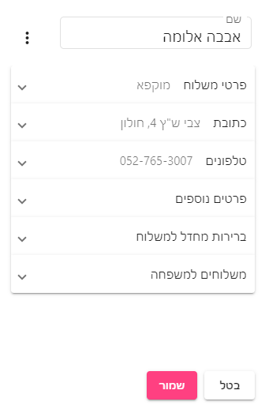
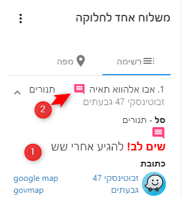
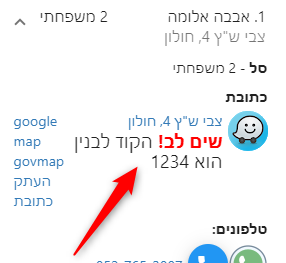
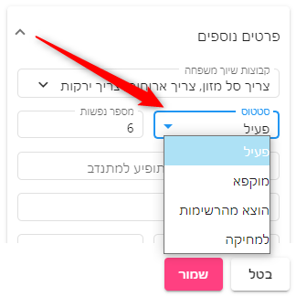
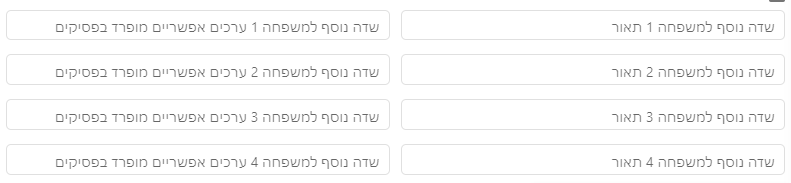
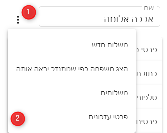

# פרטי משלוח / משפחה
מסך פרטי משלוח / משפחה מחולק ללשוניות, לחיצה על כל לשונית תפתח אותה ותציג שדות נוספים הקשורים לאותה הלשונית

## פרטי משלוח
לשונית זו מכילה את פרטי המשלוח הנוכחי. 
* לשונית זו לא תופיע אם הגעתם למסך זה דרך מסך משפחות

ואלו השדות המופיעים בלשונית:
### סוג סל
* ניתן להוסיף ולעדכן סוגי סלים במסך הגדרות מערכת
### כמות
### סטטוס משלוח
ניתן לבחור מאחד הסטטוסים הקיימים, ולראות לצד השדה את מועד העדכון האחרון של סטטוס זה.

### הערה שתופיע למתנדב
1. הערה זו תופיע בפרטי משלוח
2. בנוסף - ברשימת המשלוחים יופיע ICON אדום שנועד עבור מי שמשייך את המתנדב, ויזמין אותו להכנס להערה ולהתייחס בזמן השיוך

פה זה המקום לכתוב הערות כמו: "להגיע אחרי שש", "דובר רוסית בלבד"

הערות שקשורות לכתובת או מציאתה יש לשים בשדה "הנחיות נוספות לכתובת"

### מתנדב
המתנדב שמשוייך למשלוח

### רשימת חלוקה
יופיע רק אם מנהלים מספר רשימות חלוקה

### צריך טיפול/מעקב
האם המשלוח יופיע במסך "מצריך טיפול"

### הערות שכתב המתנדב שמסר

### הערה פנימית למשלוח - לא תוצג למתנדב
משמש בכדי לתעד את הטיפול שנעשה בהערות של המתנדב, הערות מול הרווחה יכו...

### שיוך מיוחד
משלוחים שמסומנים כ
**שיוך מיוחד**
לא ישוייכו באופן אוטומטי על ידי המערכת למתנדב - אלא יהיה צריך לבחור במשלוחים אלו באופן ספציפי במסך שיוך משפחות.

## לשונית כתובת
לשונית זו מכילה את כל הפרטים שקשורים לכתובת
### שדה כתובת
בשדה זה יש לכתוב את הכתובת כולל רחוב, מספר בית ויישוב.

הערך בשדה זה משמש לחיפוש בגוגל של הנקודה במפה
::: warning שים לב
אם הכתובת אינה כוללת יישוב, המערכת עלולה לקחת את המתנדב לעיר אחרת
:::

* ניתן ללחוץ על הקישור **הצג בגוגל MAPS** כדי לראות את הכתובת על המפה
### דירה, קומה, כניסה
### הנחיות נוספות לכתובת
בשדה זה מומלץ לרשום הסברים נוספים כמו "הקוד לבנין הוא 1234" או "הכניסה מצד ימין מאחורי החנות ירקות#

הערך בשדה זה יוצג למתנדב כך:

### כתובת כפי שגוגל הבין
מציג את הכתובת שגוגל הבין, ככה תוכלו לראות שזה באמת המקום. 
שדה זה לקריאה בלבד

### עיר (מתעדכן אוטומטית)
### אזור
### כתובת תקינה
### מיקוד

## טלפונים
ניתן להגדיר עד 4 טלפונים למשפחה. ניתן גם להוסיף הערה לטלפון, לדוגמא "הטלפון של הבת שדוברת עברית" וכו...

כאשר מעדכנים שדה זה תתבצע בדיקה האם הטלפון כבר קיים במערכת למשפחה אחרת ואם כן, תופיע אזהרה.

## פרטים נוספים
### קבוצת שיוך משפחה
ניתן לשייך כל משפחה לקבוצה אחת או יותר, ולהשתמש בזה בהמשך לביצוע סינונים ופילוחים.
את הקבוצות ניתן להקים במסך "הגדרות מערכת"

<iframe width="560" height="315" src="https://www.youtube.com/embed/TUk5cvwcStQ" frameborder="0" allow="accelerometer; autoplay; clipboard-write; encrypted-media; gyroscope; picture-in-picture" allowfullscreen></iframe>

### סטטוס (סטטוס משפחה)

1. **פעיל**
2. **מוקפא** - נועד עבור הקפאת משפחה באופן זמני, למשל במקרה שהם נסעו לקרובים בעיר אחרת לשבוע וכו - או שצריך לברר עבורם משהו
3. **הוצא מהרשימות** - נועד עבור משפחות שעברו דירה לעיר אחרת, או שחס וחלילה נפתרו.
4. **למחיקה**
:::tip טיפ
אנו ממליצים לעדכן משפחות שנפטרו או עברו דירה, או לא צריכות יותר מזון בסטוס 
**הוצא מהרשימות**
ולא למחוק אותן מכמה סיבות - אבל בעיקר מכיוון שלפעמים מי ששולח לכם את הרשימות פחות מעודכן מכם ואז ייתכן המצב הבא:
שלחתם שליח לקשיש, השליח עדכן שהקשיש נפתר חס וחלילה.

אם תמחקו את הקשיש - בהחלט יכול להיות שבקובץ הבא שתקבלו מהרווחה לבקשו שתשלחו לו כי הם לא עודכנו שהוא נפתר

במקום זאת, אם תסמנו אותו כ
**הוצא מהרשימות** 
בפעם הבא שתקבלו את הפרטים של הקשיש מערכת תתריע לכם שהוא כבר מוכר למערכת והוצא מהרשימות.
:::

::: tip טיפ 2
כאשר אתם מעדכנים סטטוס למשפחה, מומלץ מאד לכתוב בשדה הערה פנימית מדוע שיניתם את הסטטוס, כדי שבעתיד כאשר תראו משפחה שהוצאה מהרשימות תדעו למה.
:::

* את המשפחות שאינן בסטטוס פעיל, ניתן לראות במסך משפחות בלשונית **כל המשפחות**
* משפחות בסטטוס **למחיקה** אינן נמחקות עדיין מהמערכת. כדי למחוק אותן באופן סופי יש ללכת למסך הגדרות מערכת/מחיקת נתונים.

### מספר נפשות
### הערה פנימית - לא תופיע למתנדב
זה המקום לכתוב מה שבא לכם ושיישמר פרטי
### eMail
### מספר זהות ומספר זהות בן/בת זוג
**נתון זה לא יוצג למתנדבים** ומשמש בכדי למנוע כפילויות של משפחות.

* ניתן לבחור כן להציג את זה למתנדב במסך הגדרות מערכת - מומלץ שלא :)
### גורם מפנה
ניתן לעדכן את טבלת גורמים מפנים בהגדרות מערכת
### איש קשר לבירור פרטים (עו"ס)
נועד לציין את הפרטים של העו"ס הספציפי שמטפל בקשיש - כך שבמקרה שנתקלתם בבעיה, אתם יכולים ליצור איתו קשר ולברר מה קורה.

אפשר להגדיר שהטלפון הזה גם יופיע למתנדב אם הוא נתקל בבעיה - במסך "הגדרות מערכת/טלפונים לעזרה למתנדב"

### מספר משלוחים פעילים שטרם נמסרו
### תאריך לידה
### מזהה חד ערכי למשפחה
נועד בכדי לעזור בסנכרון נתונים בין אפליקצית חגי, למערכות נוספות - משמש לזיהוי חד ערכי של המשפחה

### שדות נוספים עבור הארגון
ניתן להגדיר עד ארבע שדות נוספים לפרטים נוספים על המשפחה במסך "הגדרות מערכת/העדפות"

## ברירות מחדל למשפחה

## משלוחים למשפחה
בלשונית זו יופיע הברירות מחדל למשלוח עבור המשפחה במשלוח חדש.
למשל כאן ניתן להגדיר את הכמות ברירת מחדל למשפחה זו - או את סוג הסל ברירת מחדל

בנוסף, ניתן להגדיר כאן מתנדב ברירת מחדל עבור המשפחה (עבור טיפול במתנדבים קבועים)

## פרטי עדכונים

במסך זה ניתן לראות את פרטי העדכונים למשפחה, כגון מתי היא נוספה ועל ידי מי

[מצאתם טעות? עזרו לנו לתקן](https://github.com/noam-honig/food-basket-delivery/tree/master/docs/guide/family-info.md)
