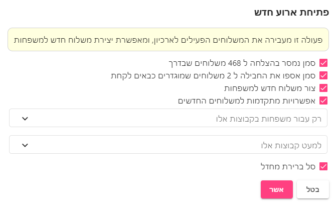

# פתיחת חלוקה חדשה
עיקר העבודה בפתיחת חלוקה חדשה, היא - מומלץ לעשות את זה בסיום החלוקה הקודמת - ואלו השלבים המומלצים
1. טיפול בבעיות
2. העברת המשלוח הקודם לארכיון
3. הוספת משלוחים חדשים

## שלב ראשון - טיפול בבעיות
מומלץ לעבור על כל הבעיות שהיו במשלוח הקודם ולטפל בהן. מומלץ לעשות את זה במסך 
[מצריך טיפול](requires-care.html)

המטרה היא שאם במשלוח הקודם עודכן שמישהו נפטר או לא מעוניין לקבל יותר סל, אזי יש להוציא את המשפחה מהרשימות (על ידי עדכון סטטוס משפחה להוצא מהרשימות) כדי שהפעם לא נשלח להם שוב משלוח.

### הוצאת משפחה מהרשימות

ניתן להוציא משפחה מהרשימות, על ידי עדכון הסטטוס של המשפחה לסטטוס **הוצא מהרשימות**
ניתן לעשות זאת בשדה [סטטוס משפחה בפרטי משלוח / משפחה](family-info.html#סטטוס-סטטוס-משפחה)

## שלב שני - העברת המשלוח הקודם לארכיון
מתוך מסך משלוחים, מסמנים את כל המשלוחים של המשלוח הקודם ומעבירים אותם לארכיון.

אם ישנם משלוחים בסטטוס טרם שוייכו - אותם עדיך למחוק.

## שלב שלישי - הוספת משלוחים
לאחר שסיימנו להעביר כל כל המשלוחים לארכיון, אנחנו עם דף נקי.

בשלב הזה - מתוך מסך משפחות, נסמן את המשפחות שאנו רוצים ליצור להן משלוח חדש ונבחר באפשרות
[משלוח חדש](families.html#%D7%94%D7%95%D7%A1%D7%A4%D7%AA-%D7%9E%D7%A9%D7%9C%D7%95%D7%97-%D7%9C%D7%9E%D7%A9%D7%A4%D7%97%D7%95%D7%AA-%D7%94%D7%9E%D7%A1%D7%95%D7%9E%D7%A0%D7%95%D7%AA)
בתפריט הטבלה

## תפריט פתיחת חלוקה חדשה
תפריט זה נועד להיות מעין קיצור שמבצע את הפעולות הללו במהלך אחד. 

בחירה בתפריט זה תעביר את כל המשלוחים הפעילים לארכיון ותאפשר פתיחת חלוקה חדשה

::: warning זהירות
תפריט זה יעביר את כלל המשלוחים הפעילים בכל רשימות החלוקה לארכיון.
:::

אפשר לסמן את **צור משלוח חדש למשפחות** ליצירת משלוח חדש לכל המשפחות - או לבחור באפשרות **אפשרויות מתקדמות למשלוחים חדשים** בכדי להגדיר הגדרות נוספות

[מצאתם טעות? עזרו לנו לתקן](https://github.com/noam-honig/food-basket-delivery/tree/master/docs/guide/new-delivery-day.md)
