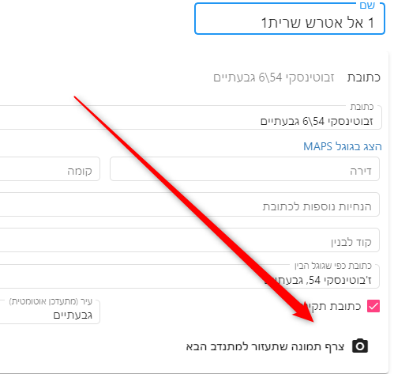
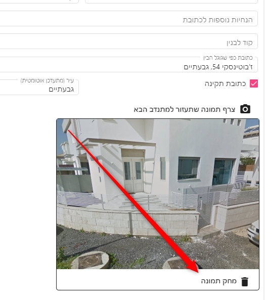
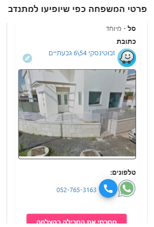
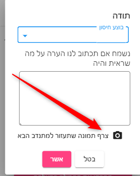
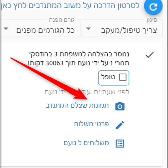
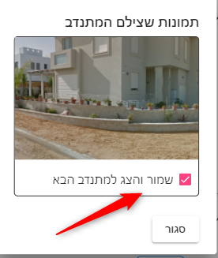

# תמונה של הבית עבור המתנדב
ישנם מקרים שתמונה יכולה לעזור למתנדב כאשר הוא מחפש כתובת.

כדי להוסיף תמונה למתנדב, מתוך פרטי משפחה - לשונית כתובת יש ללחוץ על המצלמה:

ולבחור את התמונות שרוצים.

ניתן למחוק תמונות על ידי לחיצה על מחק תמונה

### כיצד המתנדב יראה את התמונות
המתנדב יראה את התמונות מתחת לכתובת בפרטי משלוח

## הוספת תמונות על ידי המתנדב עצמו
במועד המסירה המתנדב יכול להוסיף תמונות בעצמו

אחרי שהמתנדב מוסיף את התמונות - מנהל המערכת צריך לאשר את התמונות לפני שהן תופענה למתנדבים אחרים.

אישור התמונות נעשה מתוך מסך "מצריך טיפול"

ואז מנהל המערכת רואה את התמונות שצילם המתנדב ובוחר אילו לשמור למתנדבים הבאים

