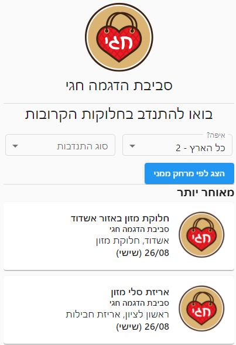
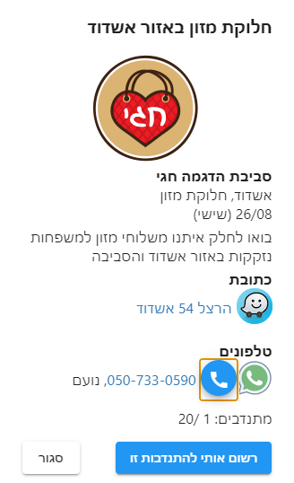
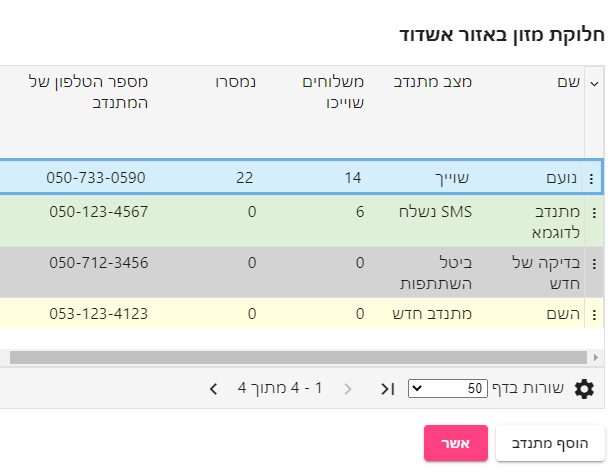
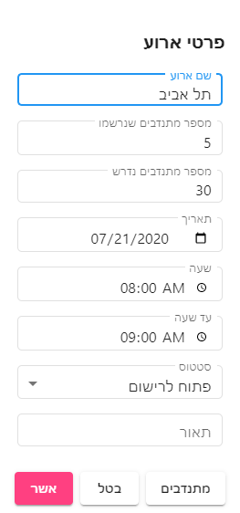
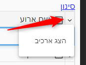
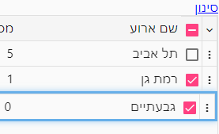
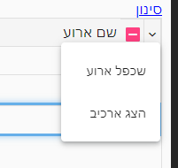
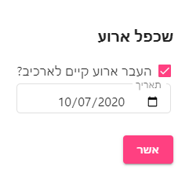
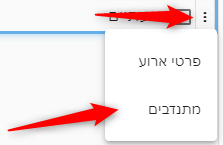

# גיוס מתנדבים
במסך "הזדמנויות התנדבות" ניתן להקים הזדמנויות התנדבות, לדוגמא "אריזת משלוחים לראש השנה" או "שינוע משלוחים לראש השנה" ולאפשר למתנדבים להרשם אליהן.

לכל הזדמנות כזו ניתן לגדיר, תאריך, שעות תאור כתובת וכו.... 

לכל ארגון יש "קישור" יחודי אותו הם יכולים להפיץ בין המתנדבים (בקבוצות ווטאסאפ או פייסבוק) ובו המתנדבים רואים את הזדמנויות התנדבות של הארגון ונרשמים אליהם (מספיק שם וטלפון כדי להרשם)

#### דוגמא לאתר התנדבות לארגון:

#### דוגמא לפרטי התנדבות:

לאחר שהמנדב נרשם, אתם יכולים לראות את פרטי המתנדבים שנרשמו ולנהל אותם

#### מסך מתנדבים להתנדבות

## גיוס מתנדבים נרחב
בנוסף לרשימה הפרטית של הארגון, לקראת ראש השנה נצא עם אתר התנדבות ארצי, שכל מי שרוצה להתנדב יוכל להכנס לשם ולמצוא את ההתנדבות שקרובה וקלה לו.

אם נשיג מספיק הזדמנויות התנדבות, נפיץ את האתר בתפוצה רחבה באמצעי התקשורת השונים בתקווה שנוכל להגיע לכמה שיותר מתנדבים

נשמח מאד אם תוסיפו את החלוקה שלכם כדי שנוכל לאפשר כמה שיותר התנדבויות ולעזור לכם להשיג מתנדבים

[לאתר הארצי לחצו כאן - נא לא להפיץ, הוא עוד בעבודה :)](https://salmaz.herokuapp.com/guest/login)

## פרטי ארוע
עבור כל ארוע ניתן להגדיר את ההגדרות הבאות:

### סטטוס ארוע
ארוע יכול להיות באחד מהסטטוסים הבאים:
1. **פתוח לרישום** - הארוע יופיע למתנדבים והם יוכלו להרשם אליו
2. **טיוטא** - הארוע לא יופיע למתנדבים
3. **ארכיון** 

### הצגת ארכיון הארועים
כאשר ארוע מועבר לארכיון - הוא אינו מוצג ברשימה.

ניתן להציג אותו על ידי בחירת האפשרות "הצג ארכיב" בתפריט הטבלה 

## שכפול ארועים
במקרים רבים מוגדרים מספר ארועים שחוזרים על עצמם מידי שבוע.

במקרה הזה, יש לשכפל את הארועים משבוע לשבוע - על ידי סימון שורות הארועים בטבלה, ובחירה באפשרות  **שכפל ארוע**

## מתנדבים רשומים לאירוע
ניתן לראות את המתנדבים המשוייכים לארוע, בעזרת תפריט השורה, אפשרות **מתנדבים**

במסך שנפתח יוצגו המתנדבים שנרשמו לארוע.

ממסך זה אפשר לשייך משלוחים לכל מתנדב, ולהוסיף מתנדבים נוספים אם רוצים.

[מצאתם טעות? עזרו לנו לתקן](https://github.com/noam-honig/food-basket-delivery/tree/master/docs/guide/events.md)