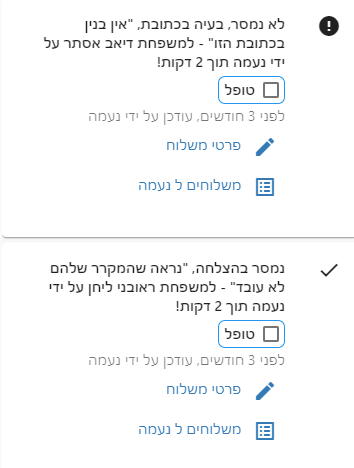

# מצריך טיפול

מסך זה נועד לטפל במשוב המתנדב הן במהלך החלוקה ולאחריה.

<iframe width="560" height="315" src="https://www.youtube.com/embed/Pa7QJTE3cqo" frameborder="0" allow="accelerometer; autoplay; clipboard-write; encrypted-media; gyroscope; picture-in-picture" allowfullscreen></iframe>

## משוב המתנדבים
כאשר מתנדבים מסמנים שהם מסרו את הסל בהצלחה או שהם נתקלו בבעיה, הם יכולים לכתוב הערה.

כל הערה שכתבו המתנדבים וכן כל משלוח שסומן כ"לא נמסר" יופיע במסך זה מסומנים כטרם טופלו.

מכאן ניתן לטפל על ידי לחיצה על הקישור **פרטי משלוח** ולהגיע לכרטיס משפחה - או לחיצה על **משלוחים לXXX** ולהגיע לשיוך המשלוחים של אותו המתנדב.

לאחר שסיימתם את הטיפול, סמנו את תיבת הסימון **טופל** כדי להוריד את המשלוח מהרשימה. (המשלוח לא יופיע לאחר שתרעננו את הרשימה)

המטרה היא לנקות את הרשימה הזו ולהיות שקטים ששום דבר לא נפל בין הכסאות.

## דוגמאות למשוב מתנדבים

* **עדכון כתובת**
המתנדב כתב שיש לעדכן את הקומה או הדירה - במקרה הזה יש להקיש על  
**פרטי משלוח**
לעדכן את השדה קומה ואז לסמן את השדה 
**טופל**
כדי להוריד את המשלוח מהרשימה.

* **סתם משתף** -
הרבה פעמים המתנדב סתם יכתוב הערה כמו "היה כיף" או משפחה חמודה וכו... זה תמיד כיף לראות - במקרים הללו נשאר רק לסמן את 
**טופל**
וזהו

::: tip טיפ
אם אתם מרגישים שאתם מוצפים בהערות מתנדבים סתמיות - ניתן לשנות את השאלה שמופיע למתנדב כאשר הוא מוסר, ב"הגדרות מערכות/הודעות למתנדב" 

ברירת המחדל היא:
"נשמח אם תכתוב לנו הערה על מה שראית והיה"

אם תשנו את השאלה, ייתכן ותשפיעו על סוג ההערות שכותבים לכם
:::

## טיפול בבעיות מסירה
מצ"ב מספר דוגמאות לבעיות מסירה, ואפשריות טיפול בהן - זו כמובן המלצה לא מחייבת :):

* **לא נמסר בעיה בכתובת** - 
במקרה הזה נשייך למתנדב משלוח אחר (הרי יש לו סל מזון באותו ואין לו למי לתת אותו). נעשה את זה על ידי לחיצה על 
**משלוחים ל XXXX**
ושם נשייך לו משלוח נוסף.

    בהמשך נברר את הכתובת של המשפחה - נעדכן את זה ב
    **פרטי משלוח** 
    ואם אנחנו רוצים להוציא משלוח נוסף נלחץ שם 
     על הכפתור 
    **משלוח חדש**
    כדי להוציא למשפחה הזו סל נוסף עם שליח אחר
* **לא נמסר אחר - הנמען נפטר**
  במקרה הזה יש להוציא את הנמען מהרשימות, נלחץ על **פרטי משלוח** ונעדכן בלשונית **פרטים נוספים** את השדה [סטטוס משפחה](family-info.html#סטטוס-סטטוס-משפחה) ל"הוצא מהרשימות"

* **לא נמסר - לא מעוניינים בחבילה** - במקרה הזה יש להוציא את הנמען מהרשימות, נלחץ על **פרטי משלוח** ונעדכן בלשונית **פרטים נוספים** את השדה [סטטוס משפחה](family-info.html#סטטוס-סטטוס-משפחה) ל"הוצא מהרשימות"

[מצאתם טעות? עזרו לנו לתקן](https://github.com/noam-honig/food-basket-delivery/tree/master/docs/guide/requires-care.md)
