# טבלאות
אפליקצית חגי עושה שימוש בטבלאות בכדי להציג את המידע במערכת.

הכרות עם הטבלה מאפשר שימוש יותר יעיל ויותר קל במערכת.

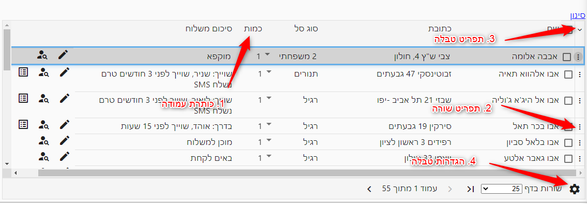
## 1. כותרת עמודה
לחיצה על כותרת העמודה תמיין את את השורות לפי עמודה זו. לחיצה נוספת תמיין אותן לפי סדר יורד.

### סינון לפי עמודה
כאשר עוברים עם הסמן מעל כותרת עמודה ניתן לסנן את השורות לפי עמודה זו, על ידי לחיצה על המשולש

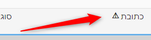

## 2. תפריט שורה
לחיצה על השלש נקודות ליד שם המשפחה תפריט עם אפשרויות המתייחסות לשורה הספציפית.

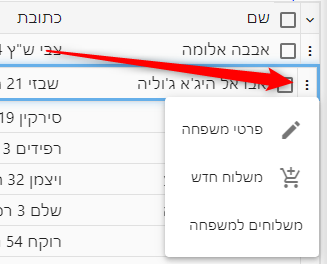

## 3. תפריט טבלה
החץ הקטן מתחת למילה סינון יפתח את "תפריט טבלה".

בתפריט זה יופיעו אפשרויות המתייחסות לכל השורות שרואים כרגע או לכל השורות המסומנות אם סומנו.

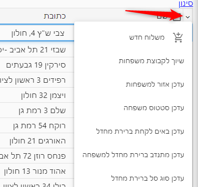

בתפריט זה ניתן למצוא גם **יצוא לאקסל** לרוב בתור האפשרות האחרונה

## 4. הגדרות טבלה - בחירת עמודות
לחיצה על הגלגל שיניים בצד ימין למטה של הטבלה, תפתח את תפריט הגדרות טבלה

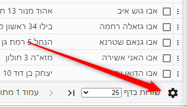

בתפריט זה ניתן לבחור עמודות נוספות שיופיעו בטבלה. יכולת זו היא מאד שימושים מכיוון שהיא מאפשרת להציג נתונים נוספים בטבלה ולערוך אותם בצורה מרוכזת.

להוספת עמודה לחצו על + במיקום הרצוי

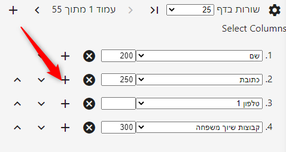

ניתן גם למחוק עמודות או לשנות את מיקומם.

לחיצה נוספת על גלגל השיניים תסגור את התפריט ותציג את הטבלה במלואה

## סינון נתונים בטבלה
ניתן ללחוץ על המילה סינון מעל הטבלא, לבחור עמודה ולבחור ערכים אשר ישמשו לסינון.

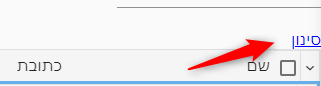

## עדכון שורות
ניתן לעדכן ערכים ישירות בטבלה, אבל חשוב לשמור אותם.
לאחר עדכון ערך כל שהוא בשורה, יופיעו בסוף השורה כפתורים לשמירת העדכון. 

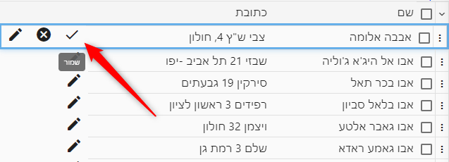

ניתן גם לשמור מתפריט השורה

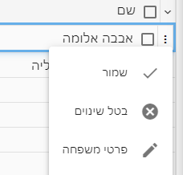

### שמירת כמה שורות בייחד
ניתן לערוך כמה שורות ואז לשמור את השינויים בכל השורות מתפריט הטבלה:
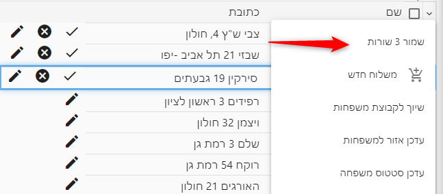

## לשוניות ופאי
בחלק מהמסכים יופיעו בראש המסך לשוניות שעוזרות בסינון והבנת תמונת המצב.

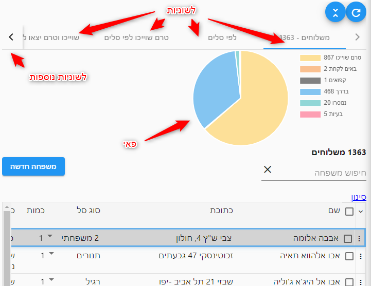
המסך מורכב ממספר חלקים:

### לשוניות
לחיצה על כל לשונית תציג פאי המתאים לאותה הלשונית, ותסנן את הטבלא להציג רק שורות המתאימות ללשונית.

### סינון לפי הפאי
לחיצה על על כל פרוסה בפאי תסנן את השורות בהתאם לאותה הפרוסה.

לביטול הסינון והצגת כל השורות יש ללחוץ על ה"הצג הכל" ליד רשימת המשלוחים
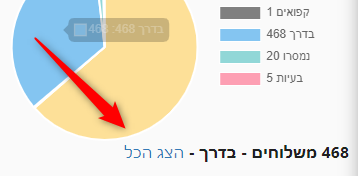

[מצאתם טעות? עזרו לנו לתקן](https://github.com/noam-honig/food-basket-delivery/tree/master/docs/guide/use-table.md)
