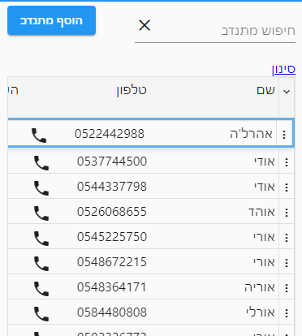
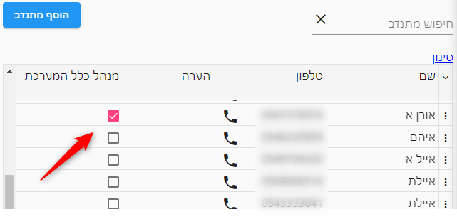
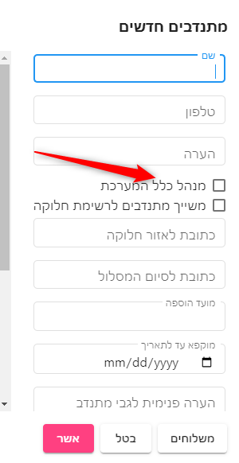
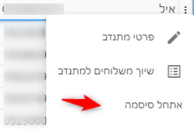

# מתנדבים
במסך זה מוצגים כל המתנדבים וכל המנהלים הרשומים.

::: tip טיפ
להסבר על תפעול המסך מומלץ מאד לקרוא את המאמר
[טבלאות](use-table.html)
 לפני שקוראים מאמר זה
:::

## איך הופכים מתנדב למנהל
מסמנים את השדה **מנהל כלל המערכת** עבורו

::: tip טיפ
לא לשכוח לשמור :)
:::

## הוספת מנהלים נוספים

ניתן להוסיף מנהלים ומתנדבים נוספים על ידי לחיצה על הכפתור **הוסף מתנדב** בצד שמאל למעלה.

עבור מנהל, יש לסמן את תיבת הסימון של **מנהל כלל המערכת**

## הרשאות

במערכת יש מספר הרשאות הניתנות להגדרה
### הרשאת מתנדב 
מתנדב רשאי רק לראות את המשלוחים אשר שוייכו לו. לאחר שהוא משלים את המשלוח - הוא יוכל לראות את פרטיו רק ליומיים.

לאחר מכן פרטי המשלוח לא יוצגו למתנדב מטעמי פרטיות.

### מנהל כלל המערכת
הרשאה זו מאפשר לבצע כל פעולה שהיא במערכת
* משתמש המוגדר בהרשאה זו יחוייב בהגדרת סיסמה

### משייך מתנדבים לרשימת חלוקה
הרשאה זו נועדה עבור משתמשים הנמצאים בנקודת החלוקה ומשייכים מתנדבים למשלוחים.

מתנדב עם הרשאה זו אינו רשאי לעדכן את פרטי המשפחות.

אם מנהלים מספר רשימות חלוקה - מתנדב עם הרשאה זו רשאי לראות רק משלוחים מרשימת החלוקה שלו

## סיסמאות
כאשר מתנדב שוכח סיסמה אפשר לאפס את הסיסמה למתנדב מתוך תפריט השורה של המתנדב.

## מחיקת מתנדב
ניתן למחוק מתנדב, בתפריט השורה של המתנדב.

מתנדב מחוק אינו באמת נמחק אלא מוסר מהרשימה.

כדי לראות מתנדבים מחוקים יש ללחוץ על ה"תפריט טבלא" ולבחור **הצג מתנדבים מחוקים**

מתנדב מחוק יופיע עם רקע אדום - ולחיצה נוספת על **מחיקת מתנדב** תבטל את מחיקתו

[מצאתם טעות? עזרו לנו לתקן](https://github.com/noam-honig/food-basket-delivery/tree/master/docs/guide/vounteers.md)